# 🔄 Agent Workflow Pipeline - Reference Guide

**Version:** 2.0  
**Last Updated:** December 15, 2025  
**Purpose:** Define the automated, validated workflow for all development tasks

---

## 📊 WORKFLOW ARCHITECTURE

### Visual Pipeline

```mermaid
graph TD
    A[User Request] --> B[00-Orchestrator]
    B --> C{Analyze Request}
    C -->|Feature| D[Feature Pipeline]
    C -->|Bug Fix| E[Bug Fix Pipeline]
    C -->|Security| F[Security Pipeline]
    C -->|Performance| G[Performance Pipeline]
    
    D --> H[Stage 1: Analysis]
    H --> I[Gate #1: Pre-Implementation]
    I --> J[Stage 2: Implementation]
    J --> K[Gate #2: Build & Test]
    K --> L[Stage 3: Quality]
    L --> M[Gate #3: Security & Performance]
    M --> N[Stage 4: Documentation]
    N --> O[Gate #4: Final Review]
    O --> P[✅ Merge Approved]
    
    I -->|❌ Failed| Q[Rollback & Report]
    K -->|❌ Failed| Q
    M -->|❌ Failed| Q
    O -->|❌ Failed| Q
```



---

## 🎯 PIPELINE TYPES

### 1. Feature Development Pipeline

**Use Case:** Adding new functionality (e.g., filters, pages, APIs)

**Stages:**

```yaml
STAGE 1 - ANALYSIS & PLANNING (30 min):
  agents:
    - 01-security-agent:
        task: "Pre-validate security risks"
        output: "SecurityAnalysis"
        blocker: true  # Pipeline stops if fails
    
    - 03-architecture-agent:
        task: "Design approach and patterns"
        output: "ArchitectureDesign"
        dependencies: ["SecurityAnalysis"]
    
    - 06-database-agent:
        task: "Plan schema changes (if needed)"
        output: "DatabasePlan"
        validation: "data-loss-check"
        dependencies: ["ArchitectureDesign"]

GATE #1 - PRE-IMPLEMENTATION VALIDATION:
  checks:
    - security_approved: true
    - design_sound: true
    - data_safe: true
    - all_dependencies_resolved: true
  action_on_failure: "BLOCK_PIPELINE"

STAGE 2 - IMPLEMENTATION (2-3h):
  agents:
    - 06-database-agent:
        task: "Execute schema changes"
        order: 1  # MUST run first
        validation: "prisma migrate status"
    
    - 05-api-agent:
        task: "Implement backend logic"
        order: 2
        dependencies: ["DatabaseMigration"]
    
    - 02-testing-agent:
        task: "Auto-generate test skeleton"
        order: 2  # Parallel with API implementation
        output: "TestSkeleton"
    
    - 11-frontend-agent:
        task: "Implement UI"
        order: 3
        dependencies: ["BackendImplementation"]

GATE #2 - BUILD & TEST VALIDATION:
  checks:
    - typescript_errors: 0
    - eslint_errors: 0
    - build_success: true
    - tests_pass: true
  commands:
    - "npm run type-check"
    - "npm run lint"
    - "npm run build"
    - "npm test"
  action_on_failure: "ROLLBACK_STAGE_2"

STAGE 3 - QUALITY ASSURANCE (1h):
  agents:
    - 01-security-agent:
        task: "Post-implementation audit"
        focus: ["multi-tenancy", "input-validation", "authorization"]
    
    - 16-performance-monitor:
        task: "Benchmark queries"
        threshold: "500ms"
        output: "PerformanceReport"
    
    - 04-performance-agent:
        task: "Optimize if needed"
        trigger: "if query > 500ms"
        dependencies: ["PerformanceReport"]

GATE #3 - SECURITY & PERFORMANCE VALIDATION:
  checks:
    - security_audit_passed: true
    - no_critical_vulnerabilities: true
    - query_performance: "<500ms"
    - test_coverage: ">=80%"
  action_on_failure: "FIX_ISSUES_BEFORE_PROCEEDING"

STAGE 4 - DOCUMENTATION & FINALIZATION (30 min):
  agents:
    - 08-documentation-agent:
        task: "Update documentation"
        subtasks:
          - "Update API docs"
          - "Consolidate related docs"
          - "Generate fresh INDEX.md"
    
    - 09-code-review-agent:
        task: "Final code review"
        checks: ["best-practices", "code-quality", "maintainability"]
    
    - 07-session-manager:
        task: "Generate completion report"
        output: "CompletionReport"

GATE #4 - FINAL REVIEW:
  checks:
    - documentation_updated: true
    - code_review_approved: true
    - all_github_checks_green: true
  action_on_pass: "APPROVE_MERGE"
  action_on_failure: "REQUEST_CHANGES"
```

---

### 2. Bug Fix Pipeline

**Use Case:** Fixing defects or issues

**Stages:**

```yaml
STAGE 1 - ROOT CAUSE ANALYSIS (30 min):
  agents:
    - 09-code-review-agent:
        task: "Analyze bug and find root cause"
        output: "RootCauseAnalysis"
    
    - 02-testing-agent:
        task: "Create failing test that reproduces bug"
        output: "ReproductionTest"

GATE #1 - BUG REPRODUCED:
  checks:
    - test_reproduces_bug: true
    - root_cause_identified: true
  action_on_failure: "REQUEST_MORE_INFO"

STAGE 2 - FIX IMPLEMENTATION (1-2h):
  agents:
    - 05-api-agent OR 11-frontend-agent:
        task: "Implement fix"
        validation: "ReproductionTest must pass"
    
    - 02-testing-agent:
        task: "Add regression tests"

GATE #2 - FIX VALIDATION:
  checks:
    - reproduction_test_passes: true
    - regression_tests_added: true
    - no_new_failures: true
  action_on_failure: "ROLLBACK_FIX"

STAGE 3 - SECURITY CHECK (if applicable):
  agents:
    - 01-security-agent:
        task: "Verify fix doesn't introduce security issues"
        trigger: "if bug_type in ['auth', 'injection', 'access-control']"

STAGE 4 - DOCUMENTATION:
  agents:
    - 08-documentation-agent:
        task: "Document bug and fix"
        output: "BugFixReport"

GATE #3 - FINAL VALIDATION:
  checks:
    - all_tests_pass: true
    - documentation_updated: true
  action_on_pass: "APPROVE_HOTFIX"
```

---

### 3. Security Issue Pipeline (CRITICAL)

**Use Case:** Addressing security vulnerabilities

**Priority:** 🔴 IMMEDIATE (Blocks all other work)

**Stages:**

```yaml
STAGE 0 - INCIDENT DECLARATION (immediate):
  actions:
    - "Create CRITICAL GitHub issue"
    - "Notify all agents"
    - "Pause other pipelines"

STAGE 1 - VULNERABILITY ANALYSIS (15 min):
  agents:
    - 01-security-agent:
        task: "Analyze vulnerability severity and impact"
        output: "VulnerabilityReport"
        includes:
          - severity: "critical|high|medium|low"
          - affected_systems: []
          - exploit_complexity: "low|medium|high"
          - data_at_risk: []

GATE #1 - SEVERITY ASSESSMENT:
  checks:
    - vulnerability_understood: true
    - impact_quantified: true
  action: "GENERATE_FIX_STRATEGY"

STAGE 2 - IMMEDIATE MITIGATION (30 min):
  agents:
    - 01-security-agent:
        task: "Generate fix"
        priority: "CRITICAL"
    
    - 02-testing-agent:
        task: "Generate security tests"
        focus: "Verify vulnerability is fixed"

STAGE 3 - FIX IMPLEMENTATION (1h):
  agents:
    - 05-api-agent:
        task: "Implement security fix"
        validation: "Security tests must pass"

GATE #2 - FIX VERIFICATION:
  checks:
    - security_tests_pass: true
    - vulnerability_closed: true
    - no_new_vulnerabilities: true
  action_on_failure: "ESCALATE_TO_MANUAL_REVIEW"

STAGE 4 - VERIFICATION & DOCUMENTATION (30 min):
  agents:
    - 01-security-agent:
        task: "Post-fix verification audit"
    
    - 08-documentation-agent:
        task: "Document incident and fix"
        output: "SecurityIncidentReport"

STAGE 5 - DEPLOYMENT:
  agents:
    - 10-devops-cicd-agent:
        task: "Deploy hotfix to production"
        priority: "IMMEDIATE"

GATE #3 - POST-DEPLOYMENT VERIFICATION:
  checks:
    - production_fix_verified: true
    - monitoring_alerts_cleared: true
  action_on_pass: "CLOSE_INCIDENT"
```

---

### 4. Performance Optimization Pipeline

**Use Case:** Improving slow queries or operations

**Stages:**

```yaml
STAGE 1 - BENCHMARKING (30 min):
  agents:
    - 16-performance-monitor:
        task: "Benchmark current performance"
        output: "PerformanceBenchmark"
        metrics:
          - query_time: "p50, p95, p99"
          - throughput: "req/s"
          - resource_usage: "CPU, memory"

GATE #1 - ISSUE CONFIRMED:
  checks:
    - performance_issue_quantified: true
    - target_improvement_defined: true  # e.g., "reduce from 1200ms to <500ms"

STAGE 2 - OPTIMIZATION STRATEGY (30 min):
  agents:
    - 04-performance-agent:
        task: "Analyze bottleneck and propose optimization"
        output: "OptimizationStrategy"
    
    - 06-database-agent:
        task: "Suggest indexes if DB-related"
        trigger: "if bottleneck_type == 'database'"

STAGE 3 - IMPLEMENTATION (1-2h):
  agents:
    - 05-api-agent OR 06-database-agent:
        task: "Implement optimization"
    
    - 02-testing-agent:
        task: "Add performance regression tests"

GATE #2 - OPTIMIZATION VALIDATION:
  checks:
    - performance_improved: true
    - target_met: true  # e.g., "query_time < 500ms"
    - no_functionality_broken: true
  action_on_failure: "ROLLBACK_OPTIMIZATION"

STAGE 4 - RE-BENCHMARKING:
  agents:
    - 16-performance-monitor:
        task: "Re-benchmark to verify improvement"
        output: "ImprovementReport"

GATE #3 - FINAL VERIFICATION:
  checks:
    - improvement_verified: true
    - tests_pass: true
  action_on_pass: "DOCUMENT_AND_MERGE"
```

---

## 🛡️ VALIDATION GATES (DETAILED)

### Gate #1: Pre-Implementation Validation

**Purpose:** Ensure safe design before any code is written

**Checks:**

```typescript
interface Gate1Validation {
  securityApproved: boolean     // 01-security-agent approved
  designSound: boolean          // 03-architecture-agent approved
  dataSafe: boolean             // 06-database-agent: no data loss risk
  dependenciesResolved: boolean // All required context available
}

// Example:
const gate1 = {
  securityApproved: true,  // ✅ Multi-tenancy approach validated
  designSound: true,       // ✅ REST patterns confirmed
  dataSafe: true,          // ✅ Nullable fields, no data loss
  dependenciesResolved: true // ✅ All context files loaded
}

// Action:
if (allChecksPass(gate1)) {
  proceedToStage2()
} else {
  blockPipeline()
  reportIssues()
}
```

**Automated Checks:**

```bash
#!/bin/bash
# gate-1-validation.sh

echo "🚦 Gate #1: Pre-Implementation Validation"

# Check 1: Security approval
if [ ! -f ".pipeline/security-approved.txt" ]; then
  echo "❌ Security approval missing"
  exit 1
fi

# Check 2: Design approval
if [ ! -f ".pipeline/design-approved.txt" ]; then
  echo "❌ Design approval missing"
  exit 1
fi

# Check 3: Data safety
if grep -q "data_loss_risk: high" .pipeline/database-plan.yaml; then
  echo "❌ High data loss risk detected"
  exit 1
fi

echo "✅ Gate #1 PASSED"
```

---

### Gate #2: Build & Test Validation

**Purpose:** Ensure code compiles and tests pass

**Checks:**

```typescript
interface Gate2Validation {
  typescriptErrors: number      // Must be 0
  eslintErrors: number          // Must be 0
  buildSuccess: boolean         // npm run build
  testsPass: boolean            // npm test
  coverageThreshold: number     // Must be >= 80%
}

// Commands executed:
const commands = [
  'npm run type-check',    // TSC validation
  'npm run lint',          // ESLint validation
  'npm run build',         // Build validation
  'npm test -- --coverage' // Test validation
]
```

**Automated Checks:**

```bash
#!/bin/bash
# gate-2-validation.sh

echo "🚦 Gate #2: Build & Test Validation"

# Check 1: TypeScript
npm run type-check
if [ $? -ne 0 ]; then
  echo "❌ TypeScript errors detected"
  exit 1
fi

# Check 2: ESLint
npm run lint
if [ $? -ne 0 ]; then
  echo "❌ ESLint errors detected"
  exit 1
fi

# Check 3: Build
npm run build
if [ $? -ne 0 ]; then
  echo "❌ Build failed"
  exit 1
fi

# Check 4: Tests
npm test -- --coverage
if [ $? -ne 0 ]; then
  echo "❌ Tests failed"
  exit 1
fi

# Check 5: Coverage
COVERAGE=$(cat coverage/coverage-summary.json | jq '.total.lines.pct')
if (( $(echo "$COVERAGE < 80" | bc -l) )); then
  echo "❌ Coverage too low: $COVERAGE% (minimum 80%)"
  exit 1
fi

echo "✅ Gate #2 PASSED"
```

---

### Gate #3: Security & Performance Validation

**Purpose:** Ensure production-ready quality

**Checks:**

```typescript
interface Gate3Validation {
  securityAuditPassed: boolean    // No critical/high vulnerabilities
  multiTenancyTestsPass: boolean  // 100% multi-tenancy tests pass
  queryPerformance: number        // p95 must be < 500ms
  testCoverage: number            // Must be >= 80%
  npmAuditClean: boolean          // No vulnerabilities in dependencies
}
```

**Automated Checks:**

```bash
#!/bin/bash
# gate-3-validation.sh

echo "🚦 Gate #3: Security & Performance Validation"

# Check 1: Security audit
if [ -f ".pipeline/security-audit-report.json" ]; then
  CRITICAL=$(cat .pipeline/security-audit-report.json | jq '.vulnerabilities.critical')
  HIGH=$(cat .pipeline/security-audit-report.json | jq '.vulnerabilities.high')
  
  if [ "$CRITICAL" -gt 0 ] || [ "$HIGH" -gt 0 ]; then
    echo "❌ Critical or high severity vulnerabilities found"
    exit 1
  fi
fi

# Check 2: Multi-tenancy tests
npm test -- --testPathPattern="multi-tenancy"
if [ $? -ne 0 ]; then
  echo "❌ Multi-tenancy tests failed"
  exit 1
fi

# Check 3: Performance
if [ -f ".pipeline/performance-benchmark.json" ]; then
  P95=$(cat .pipeline/performance-benchmark.json | jq '.p95')
  if (( $(echo "$P95 > 500" | bc -l) )); then
    echo "❌ Performance too slow: ${P95}ms (target: <500ms)"
    exit 1
  fi
fi

# Check 4: npm audit
npm audit --audit-level=moderate
if [ $? -ne 0 ]; then
  echo "❌ Dependency vulnerabilities found"
  exit 1
fi

echo "✅ Gate #3 PASSED"
```

---

### Gate #4: Documentation & Final Review

**Purpose:** Ensure documentation is up-to-date and code is review-ready

**Checks:**

```typescript
interface Gate4Validation {
  documentationUpdated: boolean     // Docs reflect changes
  apiDocsGenerated: boolean         // Swagger/OpenAPI up-to-date
  codeReviewApproved: boolean       // 09-code-review-agent approved
  allGithubChecksGreen: boolean     // CI/CD passes
  changelogUpdated: boolean         // CHANGELOG.md updated
}
```

---

## 🔄 AGENT COORDINATION PROTOCOL

### Message Format

```typescript
interface AgentMessage {
  messageId: string
  timestamp: Date
  from: string          // Agent sending
  to: string            // Agent receiving
  stage: number         // Pipeline stage
  priority: 'low' | 'medium' | 'high' | 'critical'
  payload: {
    task: string
    context: Record<string, any>
    dependencies: string[]
    validations: Validation[]
    blockers: string[]
  }
  response?: {
    status: 'approved' | 'rejected' | 'needs-revision'
    output: any
    nextAgent: string
  }
}
```

### Example Communication

```typescript
// 00-Orchestrator → 01-Security
{
  messageId: 'msg-001',
  timestamp: '2025-12-15T10:30:00Z',
  from: '00-orchestrator',
  to: '01-security-agent',
  stage: 1,
  priority: 'high',
  payload: {
    task: 'Pre-validate multi-tenancy for Review Queue filters',
    context: {
      feature: 'Add filters (studentId, status, dates)',
      affectedSystems: ['database', 'backend', 'frontend'],
      riskLevel: 'high'
    },
    dependencies: [],
    validations: [],
    blockers: []
  }
}

// 01-Security → 00-Orchestrator (Response)
{
  messageId: 'msg-001',
  timestamp: '2025-12-15T10:35:00Z',
  from: '01-security-agent',
  to: '00-orchestrator',
  stage: 1,
  priority: 'high',
  response: {
    status: 'approved',
    output: {
      risks: ['multi-tenancy-bypass'],
      mitigations: [
        'DTO validation with @IsUUID',
        'Service-level authorization check',
        'Security tests mandatory (11 tests)'
      ],
      approved: true
    },
    nextAgent: '03-architecture-agent'
  }
}
```

---

## 📊 WORKFLOW METRICS & MONITORING

### Key Performance Indicators (KPIs)

```typescript
interface WorkflowMetrics {
  pipelineSuccess Rate: number        // % of pipelines that complete successfully
  averageCompletionTime: number       // Hours from start to merge
  gateFailureRate: {
    gate1: number,  // % failures at Gate #1
    gate2: number,
    gate3: number,
    gate4: number
  }
  mostCommonBlocker: string           // e.g., "TypeScript errors"
  agentEfficiency: {
    [agentId: string]: {
      avgResponseTime: number,        // Minutes
      successRate: number             // %
    }
  }
  rollbackFrequency: number           // Rollbacks per 100 pipelines
}

// Target Metrics:
const targets = {
  pipelineSuccessRate: 0.95,          // 95%
  averageCompletionTime: 4,           // 4 hours
  gateFailureRate: {
    gate1: 0.05,  // 5% (design issues)
    gate2: 0.10,  // 10% (build/test failures)
    gate3: 0.05,  // 5% (security/performance)
    gate4: 0.02   // 2% (documentation)
  },
  rollbackFrequency: 0.03             // 3 per 100
}
```

---

## 🚀 GETTING STARTED

### For Users

Simply make a request:

```
"Add pagination to Exercise Library"
"Fix bug: Coach can't delete programs"
"Optimize slow Review Queue query"
```

The Orchestrator handles everything automatically.

### For Agents

When called by Orchestrator:

```markdown
1. READ the context provided
2. VALIDATE you have all dependencies
3. EXECUTE your task
4. RUN your validations
5. REPORT status to Orchestrator
```

### For Developers

Monitor pipeline progress:

```bash
# View active workflows
gh issue list --label "orchestrated-workflow" --state open

# View specific workflow details
gh issue view 42

# Check validation gates
cat .pipeline/gate-1-status.json
cat .pipeline/gate-2-status.json
cat .pipeline/gate-3-status.json
```

---

## 📚 ADDITIONAL RESOURCES

- [00-workflow-orchestrator.md](./00-workflow-orchestrator.md) - Orchestrator agent spec
- [AGENT_IMPROVEMENTS_ANALYSIS.md](./AGENT_IMPROVEMENTS_ANALYSIS.md) - Deep analysis of limitations
- [GitHub MCP Documentation](https://github.com/github/github-mcp-server) - MCP integration
- [Validation Scripts](./.github/workflows/) - Automated gate checks

---

**This workflow ensures:**
- ✅ Security-first approach (validated before code)
- ✅ Data safety (migration checks mandatory)
- ✅ Quality code (80%+ coverage enforced)
- ✅ Performance (queries < 500ms)
- ✅ Documentation (always up-to-date)
- ✅ Zero manual coordination (fully automated)

**Result:** Production-ready, secure, high-quality code delivered consistently. 🚀
